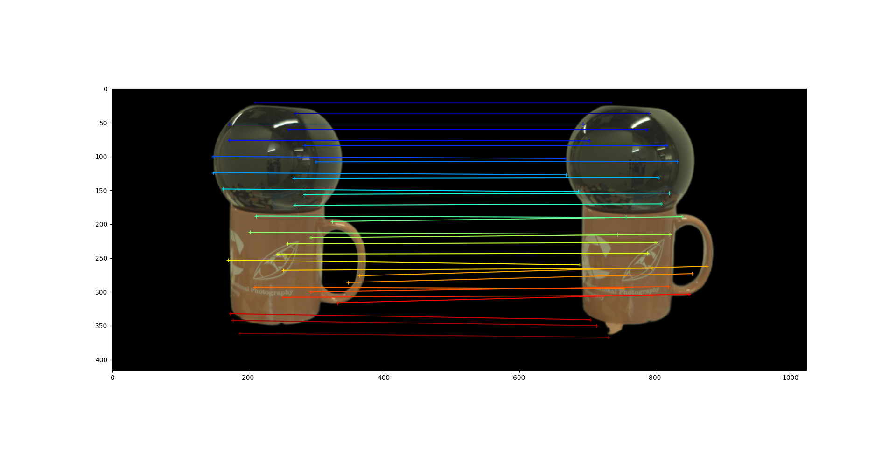

## Geometry Reconstruction of Reflective Objects

This repository presents a method developed as part of a Computer Vision course project, aimed at reconstructing the geometry of slightly reflective objects. The approach combines the **MASt3R** algorithm with **BSRD-based** reconstruction techniques.

This work was carried out during the first year of the **AIMA Master’s** program, as part of our academic curriculum.

## Table of Contents

- [Table of Contents](#table-of-contents)
- [License](#license)
- [Project Desciption](#project-description)
- [Installations and usage](#installation_and_usage)
  - [Installation](#installation)
  - [Usage](#usage)

## License
This project was carried out for academic and educational purposes. As students in training, we do not claim the perfection of our results, the method, or the exact accuracy of the findings presented.

## Project Description

The main objective of this project is to address the challenges posed by the geometry reconstruction of objects that are not fully diffuse. Reflective surfaces tend to violate the assumptions of traditional 3D reconstruction techniques, requiring hybrid or specialized methods.

## Installation and usage
### Installation
The use of a NVidia GPU is strongly recomanded!

1. Follow the installation porpose for MASt3R
   [[GitHub MASt3R](https://github.com/naver/mast3r.git)]
3. Download the PANDORA datatset
   [[PANDORA Dataset](https://akshatdave.github.io/pandora/)]
5. Install Blender
   [[Blender](https://www.blender.org/)]

### Usage
- Use "usage.py" for the matching point result
- Use "demo.py" in the mast3r directory for the MASt3R geometrical reconstruction
- Use "demo.py" in the dust3r directory for the DUSt3R geometrical reconstruction

# Others results and annexes
We choose to put in Annexes all other results we have got. All pictures and 3D reconstructed file are available into the directory bellow.

## Matching results from MASt3R

Keep calm as the gnome and its pigeon's beard

Ceramic owl

Black vase

## Reconstruction from MASt3R

Gnome

My deaarr friend: ceramic owl

Black vase

## Reconstruction from DUSt3R

Ceramic owl

I still wonder why this orange cup with a black sphere is call black vase
